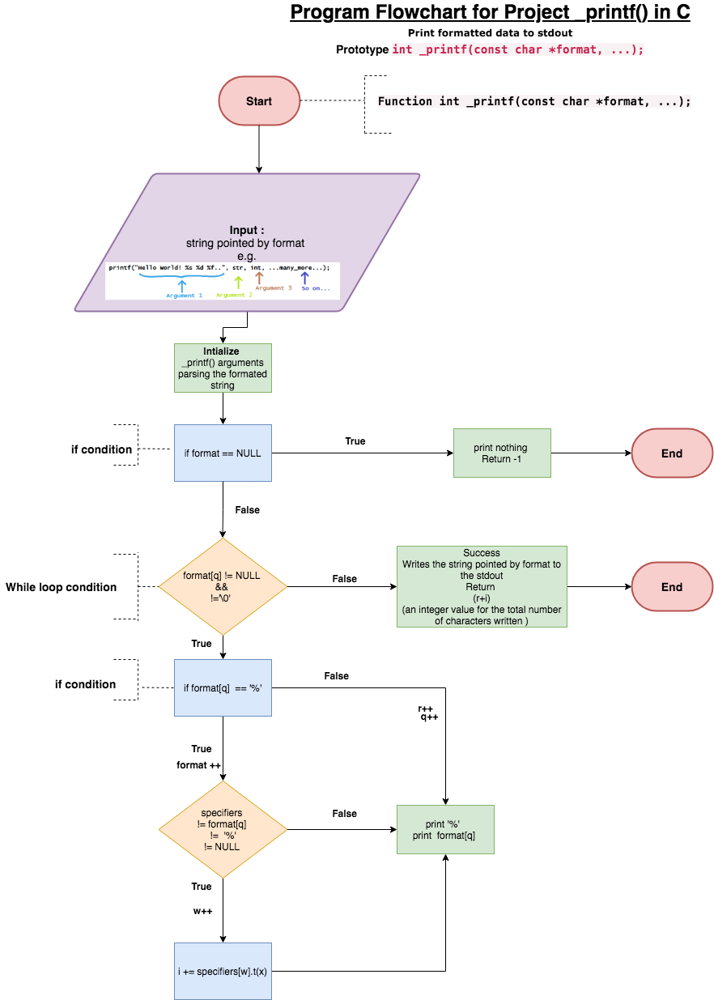

#-printf
First Holberton School group project (Pair Programming).

##description
_printf is a custom implementation of the C programming function printf.
Similar to the printf (3) - Prints formatted data to stdout

In fact the like the orginal printf it will write the C string pointed by format to the standard output (stdout). 
If format includes format specifiers (subsequences beginning with %), 
the additional arguments following format are formatted and inserted in the 
resulting string replacing their respective specifiers.

##function prototype
`int _printf(const char *format, ...);`

##format
C string that contains the text to be written to stdout.
It can optionally contain embedded format specifiers that are replaced by the values specified in subsequent additional arguments and formatted as requested.

A format specifier follows this prototype: 
##%[flags][width][.precision][length]specifier 

Where the specifier character at the end is the most significant component, since 
it defines the type and the interpretation of its corresponding argument:

Implemented format specifiers
## Specifier    | Output                 | Example     |
| :-----------: |:----------------------:| :-----------:|
| c             | Character              | a            |
| s             | String of characters   | sample       |
| d or i        | Signed decimal integer | 392          |
| %             | A % followed by another|              |
|               | % character will write |              |
|               | single % to the stream |              |

##Compilation and testing
We are compiling via:

`$ gcc -Wall -Werror -Wextra -pedantic *.c`

## flowchart for the functions flow

Authors

Montassar Barbouchi:[github](https://github.com/MontassarBar")

Mouna Ben Ali :[github](https://github.com/MounaBenAli")
